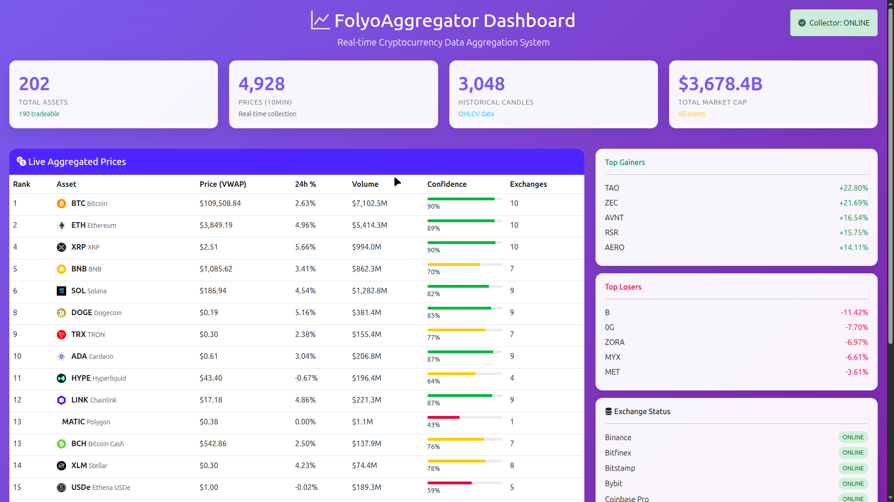

# FolyoAggregator

## Cryptocurrency Data Aggregator API

A robust cryptocurrency data aggregation system that pulls real-time price data from multiple exchanges, calculates weighted averages, and provides a unified API for accessing cryptocurrency market data.

## Features

- **Multi-Exchange Integration**: Connects to 10+ major cryptocurrency exchanges via CCXT
- **Real-time Price Aggregation**: Volume-weighted average price (VWAP) calculations
- **Historical Data**: OHLCV data storage with multiple timeframes
- **RESTful API**: Clean, documented API endpoints
- **High Performance**: Multi-level caching with Redis
- **Dashboard**: Web interface for monitoring prices and exchange status

## Technology Stack

- **Backend**: PHP 8.1+ with CCXT library
- **Database**: MariaDB
- **Cache**: Redis + APCu
- **Frontend**: HTML, CSS, JavaScript
- **Web Server**: Apache with mod_rewrite

## Installation

1. Clone the repository to `/var/www/html/folyoaggregator`
2. Install dependencies: `composer install`
3. Copy `.env.example` to `.env` and configure
4. Run database migrations: `php scripts/migrate.php`
5. Configure Apache VirtualHost for `folyoaggregator.test`
6. Start background workers: `php scripts/workers/price-updater.php`

## API Endpoints

### Assets
- `GET /api/v1/assets` - List all supported cryptocurrencies
- `GET /api/v1/assets/{symbol}` - Get details for specific asset

### Prices
- `GET /api/v1/prices/{symbol}` - Get aggregated price
- `GET /api/v1/prices/{symbol}/exchanges` - Get prices by exchange
- `GET /api/v1/prices/multiple?symbols=BTC,ETH` - Get multiple prices

### Historical Data
- `GET /api/v1/ohlcv/{symbol}?timeframe=1h` - Get OHLCV data

## Development

Access the application at: `http://folyoaggregator.test`

### Database Access
```bash
mariadb -p -u root folyoaggregator
```

### View Logs
```bash
tail -f logs/app.log
tail -f /var/log/apache2/folyoaggregator-error.log
```

## License

Private - All rights reserved

## Contact

For questions and support, contact the development team.